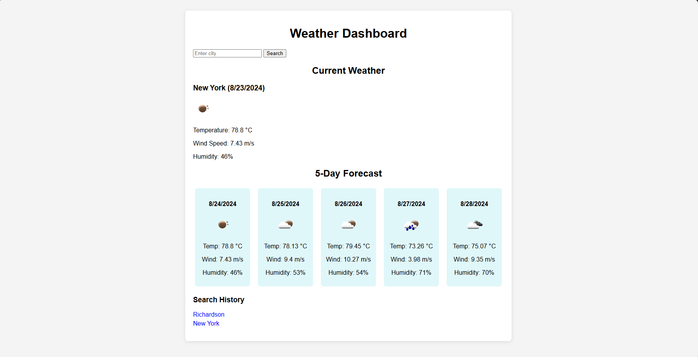

# Weather Dashboard

## Description

This Weather Dashboard is a simple web application that allows users to search for weather information by city. It provides both the current weather and a 5-day forecast, displaying data such as temperature, wind speed, and humidity. The app stores a search history using `localStorage`, so users can quickly revisit cities they’ve previously searched for. 

## Table of Contents

- [Installation](#installation)
- [Usage](#usage)
- [Features](#features)
- [Screenshots](#screenshots)
- [Technologies Used](#technologies-used)
- [License](#license)

## Installation

To run this project locally:

1. Clone this repository using the following command:
   \`\`\`bash
   git clone git@github.com:DJDEVJAMS/weather_dashboard.git

2. Open the \`index.html\` file in your browser to start the application.

Alternatively, you can view the deployed application [here](https://djdevjams.github.io/weather_dashboard/).

## Usage

1. Enter a city name in the search box and click the "Search" button.
2. The current weather conditions will be displayed at the top, and a 5-day forecast will appear below.
3. Each search will be saved to a search history list below the forecast.
4. Clicking on a city in the search history will re-load the weather information for that city.

## Features

- **Search for any city**: Enter a city name to retrieve the current weather and a 5-day forecast.
- **Current Weather**: Displays the city name, today's date, a weather icon, temperature, humidity, and wind speed.
- **5-Day Forecast**: Shows future conditions, including temperature, wind speed, humidity, and weather icons.
- **Search History**: Saves cities to local storage and displays them as clickable items for easy reloading of weather data.

## Screenshots

## Technologies Used

- **HTML/CSS**: For the structure and styling of the web page.
- **JavaScript**: To handle the API calls, data manipulation, and dynamic updates to the DOM.
- **OpenWeather API**: Used to fetch current and forecasted weather data for searched cities.
- **LocalStorage**: To store the search history so that it persists across page reloads.

## License
